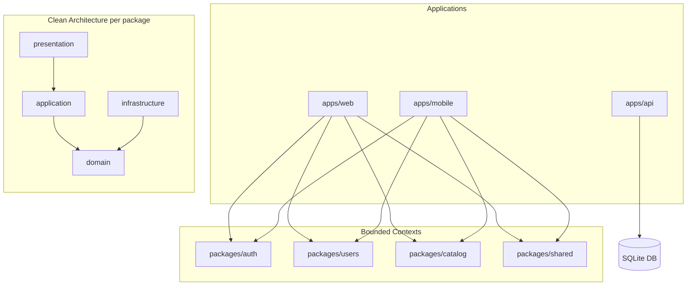
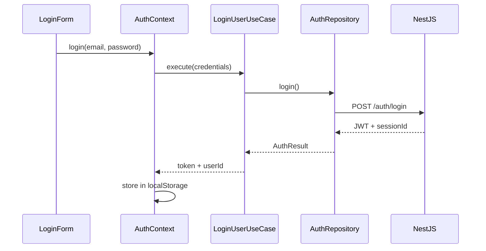
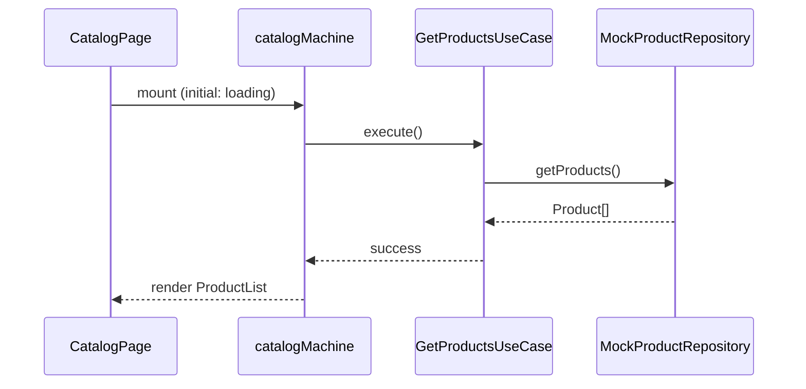
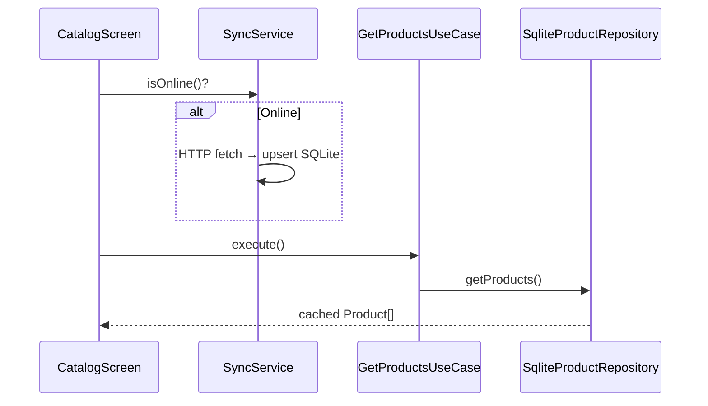

# Architecture

Comprehensive architecture reference for the **DDD Store Example** monorepo.

## Project Overview

This is an educational full-stack monorepo demonstrating:

| Concept | Implementation |
|---------|----------------|
| Domain Driven Design | Bounded contexts in `packages/auth`, `packages/users`, `packages/catalog` |
| Clean Architecture | `domain` → `application` → `infrastructure` → `presentation` per package |
| Vertical Slices | Feature folders in `apps/web/src/features/` and `apps/mobile/src/features/` |
| Monorepo | npm workspaces sharing business logic across web, mobile, API |
| Repository Pattern | Interfaces in domain, implementations in infrastructure |
| Dependency Inversion | DI containers in `apps/*/src/di/container.ts` |
| Offline-first (mobile) | SQLite as UI source of truth, API sync when online |

### Applications

```
apps/web     → React + Vite + XState + Tailwind
apps/mobile  → Expo + SQLite + NativeWind
apps/api     → NestJS + Prisma + SQLite
```

### Shared Packages

```
packages/shared   → Session, Role, Email, Money, errors
packages/auth     → Login, logout, token management
packages/users    → Profiles, session listing
packages/catalog  → Product CRUD and browsing
```

---

## Dependency Diagram



### Dependency Rule

**Source code dependencies point inward.**

| Layer | May import | Must NOT import |
|-------|-----------|-----------------|
| `domain` | domain, shared | application, infrastructure, presentation, frameworks |
| `application` | domain, application | infrastructure, presentation, HTTP, React |
| `infrastructure` | domain, application | presentation |
| `presentation` | domain, application | infrastructure (use DI instead) |
| `apps/*` | everything | — (composition root) |

---

## Data Flow Diagrams

### Web Login



### Catalog Browse (Mock Mode)



### Mobile Offline Read



---

## DDD Concepts Used

### Bounded Contexts

Each `packages/*` folder is a bounded context with its own ubiquitous language:

- **auth** — credentials, tokens, login/logout
- **users** — profiles, roles, sessions
- **catalog** — products, categories, pricing

### Entities

Objects with identity, e.g. `User`, `Product`, `Session` in `domain/entities/`.

### Value Objects

Immutable objects without identity: `Email`, `Money`, `Role` in `packages/shared`.

### Repositories (interfaces)

Defined in `domain/repositories/`. The domain declares **what** data it needs; infrastructure provides **how**.

```typescript
// packages/catalog/src/domain/repositories/ProductRepository.ts
export interface ProductRepository {
  getProducts(): Promise<Product[]>;
}
```

### Application Services (Use Cases)

One class per business scenario in `application/use-cases/`:

- `LoginUserUseCase` — validates input, delegates to AuthRepository
- `GetProductsUseCase` — fetches products via repository interface
- `TerminateSessionUseCase` — ends a remote session

### Anti-Corruption Layer

`infrastructure/mappers/` convert API DTOs to domain entities, isolating external shapes from the domain model.

---

## Clean Architecture Layers

### Domain (`domain/`)

Pure business rules. No frameworks.

```
packages/catalog/src/domain/
  entities/Product.ts
  repositories/ProductRepository.ts   ← interface only
```

### Application (`application/`)

Orchestrates domain objects for use cases.

```
packages/catalog/src/application/use-cases/GetProductsUseCase.ts
```

### Infrastructure (`infrastructure/`)

Technical implementations swapped via DI.

```
infrastructure/api/HttpProductRepository.ts    ← real API
infrastructure/mocks/MockProductRepository.ts    ← dev without backend
infrastructure/database/SqliteProductRepository.ts ← mobile offline
```

### Presentation (`presentation/`)

UI code. XState machines invoke use cases — never HTTP directly.

```
presentation/machines/catalogMachine.ts
presentation/components/ProductList.tsx
```

---

## Repository Pattern

```typescript
// 1. Domain defines interface
interface ProductRepository {
  getProducts(): Promise<Product[]>;
}

// 2. Use case depends on interface
class GetProductsUseCase {
  constructor(private repo: ProductRepository) {}
  execute() { return this.repo.getProducts(); }
}

// 3. App wires implementation (apps/web/src/di/container.ts)
const repo = useMock
  ? new MockProductRepository()
  : new HttpProductRepository(apiClient);
const getProductsUseCase = new GetProductsUseCase(repo);
```

The use case never knows whether data comes from HTTP, SQLite, or memory.

---

## Offline-First Architecture (Mobile)

### Principle

SQLite is the **source of truth for the UI**. The API updates SQLite when online.

```
Online:  API → SyncService → SQLite → UseCase → UI
Offline:              SQLite → UseCase → UI
```

### Components

| File | Role |
|------|------|
| `apps/mobile/src/db/sqlite.ts` | Schema creation, sync metadata |
| `apps/mobile/src/db/repositories/SqliteProductRepository.ts` | Read products from SQLite |
| `apps/mobile/src/db/sync/SyncService.ts` | Pull from API, upsert locally |
| `apps/mobile/src/features/OfflineBanner.tsx` | Shows last sync timestamp |

### Sync Metadata

```sql
CREATE TABLE sync_metadata (key TEXT PRIMARY KEY, value TEXT NOT NULL);
-- key = 'lastSyncedAt', value = ISO timestamp
```

---

## Web vs Mobile Differences

| Aspect | Web | Mobile |
|--------|-----|--------|
| Session expiry | 24h (`expiresAt` set) | No auto-expire (`expiresAt: null`) |
| Token storage | localStorage | SQLite `auth_tokens` table |
| Data source | HTTP or Mock | SQLite (synced from HTTP) |
| State management | XState machines | React hooks + use cases |
| Offline support | No (mock mode instead) | Yes, with stale-data banner |
| Styling | Tailwind CSS | NativeWind |

### Mock Mode

| Platform | Variable |
|----------|----------|
| Web | `VITE_USE_MOCK=true` |
| Mobile | `EXPO_PUBLIC_USE_MOCK=true` |

---

## API Structure

NestJS modules mirror bounded contexts with Clean Architecture folders:

```
apps/api/src/modules/
  auth/       POST /auth/login, /logout, /refresh, GET /auth/me
  users/      GET/PATCH /users/me, GET /users/me/sessions
  catalog/    GET /products, /products/:id
  sessions/   DELETE /sessions/:id
  admin/      GET /admin/users, /admin/sessions, CRUD /admin/products
```

JWT auth with `@Roles('ADMIN')` guard for admin endpoints.

---

## Testing Strategy

| Layer | Tool | Location |
|-------|------|----------|
| Domain | Vitest | `packages/*/src/domain/**/*.test.ts` |
| Application | Vitest | `packages/*/src/application/**/*.test.ts` |
| Infrastructure | Vitest | `packages/*/src/infrastructure/**/*.test.ts` |
| Web UI | Vitest + RTL | `apps/web/src/**/*.test.tsx` |
| API | Jest | `apps/api/src/**/*.spec.ts` |

---

## Getting Started

```bash
npm install

# Web (mock mode, no API needed)
npm run dev:web

# API
cd apps/api && npm run db:generate && npm run db:migrate && npm run db:seed
npm run dev:api

# Web with real API
VITE_USE_MOCK=false npm run dev:web

# Mobile
npm run dev:mobile
```

### Demo Credentials

| Email | Password | Role |
|-------|----------|------|
| admin@demo.com | password123 | ADMIN |
| user@demo.com | password123 | USER |

---

## Further Reading

- [docs/01-project-overview.md](docs/01-project-overview.md)
- [docs/03-dependency-rules.md](docs/03-dependency-rules.md)
- [docs/04-data-flows.md](docs/04-data-flows.md)
- [docs/06-offline-first.md](docs/06-offline-first.md)
- Layer READMEs in each `packages/*/src/*/README.md`
