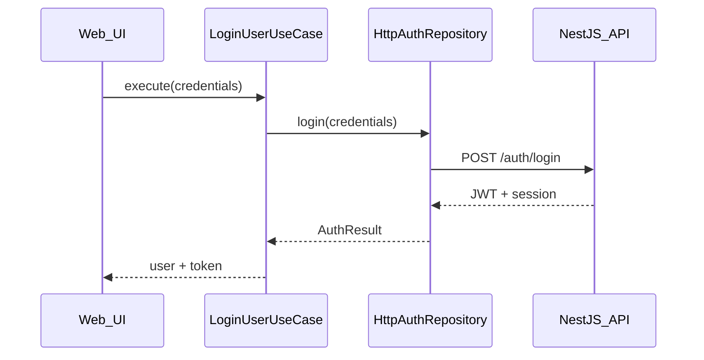
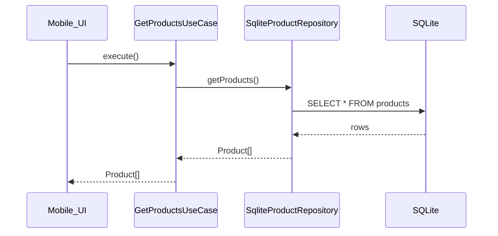

# Data Flows

## 1. Login Flow (Web)

```
User submits form
    ↓
LoginForm component dispatches XState event
    ↓
authMachine → state: submitting
    ↓
invokes LoginUserUseCase.execute(credentials)
    ↓
AuthRepository.login()  [HttpAuthRepository or MockAuthRepository]
    ↓
API POST /auth/login  →  creates Session with expiresAt
    ↓
Returns AuthToken + User
    ↓
authMachine → state: authenticated
    ↓
Router redirects to /catalog
```

## 2. Catalog Fetch (Web — Mock Mode)

```
/catalog page mounts
    ↓
catalogMachine → state: loading
    ↓
invokes GetProductsUseCase.execute()
    ↓
ProductRepository.getProducts()  [MockProductRepository]
    ↓
Returns in-memory Product[]
    ↓
catalogMachine → state: success
    ↓
ProductList renders products
```

## 3. Catalog Fetch (Web — API Mode)

Same flow, but `HttpProductRepository` calls `GET /api/products` and maps JSON to domain entities.

## 4. Profile & Sessions

```
/profile page mounts
    ↓
profileMachine loads user via GetUserProfileUseCase
sessionsMachine loads via ListActiveSessionsUseCase
    ↓
SessionRepository.getActiveSessions(userId)
    ↓
UI shows:
  - Current device (matched by userAgent)
  - Other active sessions with Terminate button
    ↓
User clicks Terminate
    ↓
TerminateSessionUseCase.execute(sessionId)
    ↓
SessionRepository.terminate(sessionId)
    ↓
DELETE /sessions/:id
```

## 5. Admin Product CRUD

```
/admin page (ADMIN role required)
    ↓
Role guard checks user.role === 'ADMIN'
    ↓
adminMachine manages product list state
    ↓
CreateProductUseCase / UpdateProductUseCase / DeleteProductUseCase
    ↓
ProductRepository (HTTP → POST/PATCH/DELETE /admin/products)
```

## 6. Mobile Offline Catalog

```
App launches (possibly offline)
    ↓
SyncService checks network
    ↓
[Online]  API → SQLite upsert → sync_metadata.lastSyncedAt = now
[Offline] Skip sync
    ↓
CatalogScreen mounts
    ↓
GetProductsUseCase → SqliteProductRepository → reads local SQLite
    ↓
UI shows products + offline banner with lastSyncedAt
```

## 7. Mobile Login with Refresh Token

```
LoginScreen → LoginUserUseCase (deviceType: MOBILE)
    ↓
API creates session (expiresAt: null) + refresh token
    ↓
SqliteAuthRepository persists tokens locally
    ↓
[Later, online] TokenRefreshService calls POST /auth/refresh
    ↓
Updates local access token
```

## Sequence: Web Session Lifecycle



## Sequence: Mobile Offline Read


